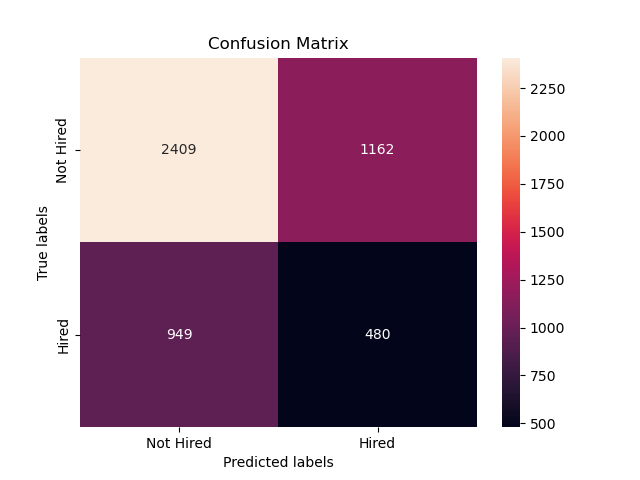
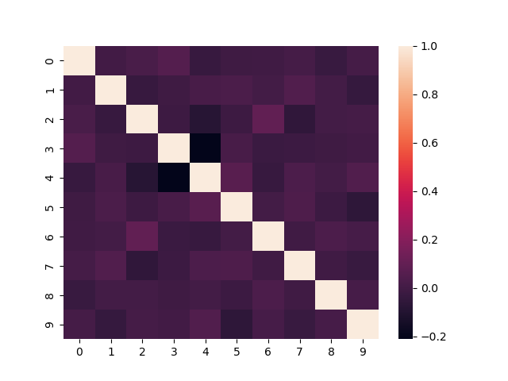

 # How to Train Your Leviathan
Machines don't always make the best decisions. The dataset that trains them represents individual decisions based on an array of criteria--some rational and some arbitrary. But human decision-makers are generally biased and only sometimes consistent. And from these instructors, machines can quickly learn to be consistently biased. 

It is the consistency of the algorithm that presents the most significant problem. When one algorithm is adopted widely, and its outputs determine access to opportunities (such as jobs), it becomes an "algorithmic leviathan" capable of doing great societal harm. In the worst-case scenario, an unfair judgment on a person's qualifications propagates across all employers, effectively ending an individual's career. In the realm of ethical AI, it's a problem referred to as Systematicity.

The solution is counter-intuitive. It's to add back a bit of arbitrariness. AI can be highly accurate, but it is never infallible. And a single, monolithic model is more prone to Systematicity. To avoid it, we can train a panel of models intentionally designed to be similar in accuracy but variable in approach (i.e., what features they consider), much like the human decision-makers they replace.

## Training with Randomness
This exercise uses decision tree classifiers on a dataset of roughly 50,000 job candidates labeled with a binary target variable (hired or not-hired). Decision trees predict outcomes by learning a set of rules from the data. These rules are applied in sequence to predict a result. And that outcome is easy to explain by tracing the candidate's data through the rules. 

Decision trees have the advantage of being mathematically simple and efficient. They also meet a crucial principle of ethical AI: transparency and explainability. That said, the tactics applied in this exercise could extend to other types of models as well.

Bootstrapping provides the randomness to the Random Forest ensemble. It refers to the process of selecting a new sample from the training data to build each model. Because the training algorithm samples with replacement, it draws some records in the dataset more than once and excludes others entirely. Bootstrapping will leave out approximately one-third of the observations in each sample. These "out-of-bag" or OOB  records are useful for testing the accuracy of each tree in the forest. 

Another way to avoid creating a homogenous ensemble of classifiers is to vary the features used in each tree. These are the factors that predict the outcomes of the model. A decision tree uses a measure of information gain to determine which variables have the most predictive power. It generates rules based on the predictor and the quantitative threshold that best differentiates one class (hired) from another (not hired). The training algorithm randomly selects a subset of features for each model to diversify the predictors in the group. The order of the feature list is random as well. Because multiple rules may have the same information gain, a change in the order of the feature list can generate a different classification tree.

Finally, we introduce randomness at prediction time. Rather than aggregating the predictions and outputting the class with the highest frequency, this algorithm randomly selects a prediction from the set of models.

## Evaluating the Results
Testing the model produced the evaluation metrics conventionally used to assess performance. This model still needs to be optimized for accuracy, and the results could have been more impressive from that standpoint. The OOB error rates ranged from 30% to 40%, and the accuracy of the ensemble was a meager 60%. Particularly concerning from an ethical AI perspective was the false negative rate of 75%, which would block many individuals from job opportunities if implemented at scale. At least some of this error stems from the unbalanced training data. Just 30% of the observations in the training dataset were in the "hired" class. 

The assemble model appears to meet the objective of avoiding Systematicity, however. The predictions are heterogeneous and show a low correlation between them. The correlation heatmap below illustrates this point.

A final test of Systematicity should confirm that the panel of classifiers does not form a false negative consensus for any candidates. From the pool of hired candidates, we can check to see how many (if any) candidates meet this criterion. If even one does, it is a clear signal to keep trying new algorithms and techniques.

## Next Steps
Follow on work to build a functional group of classifiers would include the following:
* Preprocessing to address the issue of the unbalanced training data.
* Testing the training algorithm with different parameters.
* Adding and testing different types of models.
* Boosting and stacking to improve the performance of the classifiers.

Acknowledgments: Much of the source code for building decision trees draws from the following articles.
* https://carbonati.github.io/posts/random-forests-from-scratch/
* https://towardsdatascience.com/predicting-the-survival-of-titanic-passengers-30870ccc7e8

